# DHL Global Logistics - Flowise Multi-Agent Workflow

A comprehensive Flowise multi-agent system representing DHL's global logistics organization with 8 specialized operational agents.

## Overview

This Flowise workflow models DHL's core business operations across 220+ countries, providing intelligent routing to specialized agents for express delivery, customs clearance, supply chain management, freight transport, customer service, technology & innovation, sustainability, and global operations.

**File**: `flowise-dhl-operations.json` (1,165 lines)

## 📊 Workflow Architecture

**[View Full Workflow Diagram →](./WORKFLOW-DIAGRAM.md)**

```mermaid
%%{init: {'theme':'base', 'themeVariables': { 'primaryColor':'#4DD0E1','primaryTextColor':'#000','primaryBorderColor':'#0097A7','lineColor':'#757575','secondaryColor':'#ff8fab','tertiaryColor':'#7EE787'}}}%%
graph TD
    startAgentflow_0([🚀 Start])
    style startAgentflow_0 fill:#7EE787,stroke:#333,stroke-width:2px
    conditionAgentAgentflow_0{{🎯 Intent Router}}
    style conditionAgentAgentflow_0 fill:#ff8fab,stroke:#333,stroke-width:2px
    agentAgentflow_1[🤖 Agent.Express]
    style agentAgentflow_1 fill:#4DD0E1,stroke:#333,stroke-width:2px
    agentAgentflow_2[🤖 Agent.Customs]
    style agentAgentflow_2 fill:#4DD0E1,stroke:#333,stroke-width:2px
    agentAgentflow_3[🤖 Agent.SupplyChain]
    style agentAgentflow_3 fill:#4DD0E1,stroke:#333,stroke-width:2px
    agentAgentflow_4[🤖 Agent.Freight]
    style agentAgentflow_4 fill:#4DD0E1,stroke:#333,stroke-width:2px
    agentAgentflow_5[🤖 Agent.CustomerService]
    style agentAgentflow_5 fill:#4DD0E1,stroke:#333,stroke-width:2px
    agentAgentflow_6[🤖 Agent.Technology]
    style agentAgentflow_6 fill:#4DD0E1,stroke:#333,stroke-width:2px
    agentAgentflow_7[🤖 Agent.Sustainability]
    style agentAgentflow_7 fill:#4DD0E1,stroke:#333,stroke-width:2px
    agentAgentflow_8[🤖 Agent.GlobalOps]
    style agentAgentflow_8 fill:#4DD0E1,stroke:#333,stroke-width:2px

    startAgentflow_0 --> conditionAgentAgentflow_0
    conditionAgentAgentflow_0 -->|S0| agentAgentflow_1
    conditionAgentAgentflow_0 -->|S1| agentAgentflow_2
    conditionAgentAgentflow_0 -->|S2| agentAgentflow_3
    conditionAgentAgentflow_0 -->|S3| agentAgentflow_4
    conditionAgentAgentflow_0 -->|S4| agentAgentflow_5
    conditionAgentAgentflow_0 -->|S5| agentAgentflow_6
    conditionAgentAgentflow_0 -->|S6| agentAgentflow_7
    conditionAgentAgentflow_0 -->|S7| agentAgentflow_8
```

   



<details>
<summary><b>🔍 View Agent Details (Click to Expand)</b></summary>

| Agent | Type | Description |
|-------|------|-------------|
| 🚀 Start | Start | Starting point of the agentflow |
| 🎯 Intent Router | ConditionAgent | Route user to appropriate agent based on detect... |
| 🤖 Agent.Express | Agent | Dynamically choose and utilize tools during run... |
| 🤖 Agent.Customs | Agent | Dynamically choose and utilize tools during run... |
| 🤖 Agent.SupplyChain | Agent | Dynamically choose and utilize tools during run... |
| 🤖 Agent.Freight | Agent | Dynamically choose and utilize tools during run... |
| 🤖 Agent.CustomerService | Agent | Dynamically choose and utilize tools during run... |
| 🤖 Agent.Technology | Agent | Dynamically choose and utilize tools during run... |
| 🤖 Agent.Sustainability | Agent | Dynamically choose and utilize tools during run... |
| 🤖 Agent.GlobalOps | Agent | Dynamically choose and utilize tools during run... |

</details>

## Features

✅ **8 Specialized DHL Agents**:
- **Express Delivery** - Time-critical shipments and priority packages
- **Customs Clearance** - International regulations and documentation
- **Supply Chain** - Warehousing, inventory, and distribution
- **Freight Transport** - Air, ocean, and ground cargo
- **Customer Service** - Tracking, support, and problem resolution
- **Technology & Innovation** - Tracking systems, drones, APIs, automation
- **Sustainability** - GoGreen program and carbon-neutral shipping
- **Global Operations** - 220+ countries coverage and network coordination

✅ **Intelligent Intent Routing** - Condition node with keyword-based detection

✅ **Self-Contained Architecture** - All configurations inline (no external dependencies)

✅ **Production-Ready** - Validated JSON structure, ready for Flowise import

## Quick Start

### Import to Flowise

1. Open your Flowise web interface
2. Navigate to **Agentflows**
3. Click **Import**
4. Select `flowise-dhl-operations.json`
5. Verify all nodes render correctly
6. Test with sample queries

### Sample Queries

Try these queries to test agent routing:

```
Express Delivery:
- "I need overnight shipping to Germany"
- "What are your same-day delivery options?"

Customs:
- "What documents do I need for customs clearance?"
- "How do I calculate import duties?"

Supply Chain:
- "Can you help optimize our warehouse distribution?"
- "We need inventory management solutions"

Freight:
- "I need to ship 50 pallets by ocean freight"
- "What are your air freight rates?"

Customer Service:
- "Where is my package? Tracking: 123456789"
- "I need to change my delivery address"

Technology:
- "Do you have an API for tracking integration?"
- "Tell me about your drone delivery program"

Sustainability:
- "What are your carbon-neutral shipping options?"
- "How can I offset my shipment's carbon emissions?"

Global Operations:
- "Which countries does DHL serve?"
- "Where are your main hubs located?"
```

## Architecture

### Structure

```
flowise-dhl-operations.json
├── nodes (10 total)
│   ├── startAgentflow_0 (Entry point)
│   ├── conditionAgentAgentflow_0 (Intent router with 8 scenarios)
│   ├── agentAgentflow_1 (Agent.Express)
│   ├── agentAgentflow_2 (Agent.Customs)
│   ├── agentAgentflow_3 (Agent.SupplyChain)
│   ├── agentAgentflow_4 (Agent.Freight)
│   ├── agentAgentflow_5 (Agent.CustomerService)
│   ├── agentAgentflow_6 (Agent.Technology)
│   ├── agentAgentflow_7 (Agent.Sustainability)
│   └── agentAgentflow_8 (Agent.GlobalOps)
└── edges (9 total)
    └── Start → Condition → 8 Specialized Agents
```

### Node Types

- **All nodes**: `type="agentFlow"`
- **Model**: OpenAI `gpt-4o-mini`
- **Memory**: Window size (30 messages)
- **Temperature**: 0.2-0.5 (optimized per agent role)

## DHL Company Profile

- **Founded**: 1969 by Adrian Dalsey, Larry Hillblom, Robert Lynn
- **Parent Company**: Deutsche Post (acquired 2002)
- **Global Reach**: 220+ countries
- **Core Services**:
  - Express delivery and international shipping
  - Customs clearance expertise
  - Supply chain management
  - Freight transportation (air, ocean, ground)
  - Real-time tracking technology
  - Sustainability initiatives (electric vehicles, carbon reduction)

## Technical Details

### Validation Results

✅ **JSON Structure**: Valid
✅ **Total Nodes**: 10 (as required)
✅ **Total Edges**: 9 (as required)
✅ **Node Types**: All `agentFlow` ✅
✅ **File Size**: 1,165 lines (exceeds 1,000 minimum)
✅ **Configuration**: All inline (no external references)

### Agent Temperature Settings

| Agent | Temperature | Rationale |
|-------|-------------|-----------|
| Condition Router | 0.2 | Deterministic routing |
| Express | 0.3 | Factual with flexibility |
| Customs | 0.2 | Highly accurate regulatory info |
| SupplyChain | 0.4 | Strategic planning flexibility |
| Freight | 0.3 | Factual logistics |
| CustomerService | 0.5 | Empathetic, helpful tone |
| Technology | 0.4 | Innovative but accurate |
| Sustainability | 0.4 | Informative and persuasive |
| GlobalOps | 0.3 | Factual network information |

## Project Structure

```
dhl-flowise-operations/
├── flowise-dhl-operations.json    # Main Flowise workflow (1,165 lines)
├── README.md                       # This file
├── .gitignore                      # Git ignore rules
└── .context-foundry/               # Build artifacts
    ├── scout-report.md             # Requirements analysis
    ├── architecture.md             # Technical specifications
    ├── build-log.md                # Build validation results
    └── current-phase.json          # Build phase tracking
```

## Technologies

- **Platform**: Flowise AI
- **Model Provider**: OpenAI
- **Model**: gpt-4o-mini
- **Architecture**: Multi-agent intent routing
- **Configuration**: JSON (self-contained)

## References

Built following official Flowise multi-agent patterns:
- **AGENT_PATTERN_REFERENCE.md** - Self-contained agent architecture
- **COMPLETE-FLOW-TEMPLATE.md** - Complete inline configuration template
- **warehouse-operations-flow.json** - Canonical reference example (1,164 lines)

## License

Generated for DHL logistics operations modeling.

---

🤖 Built autonomously by Context Foundry
